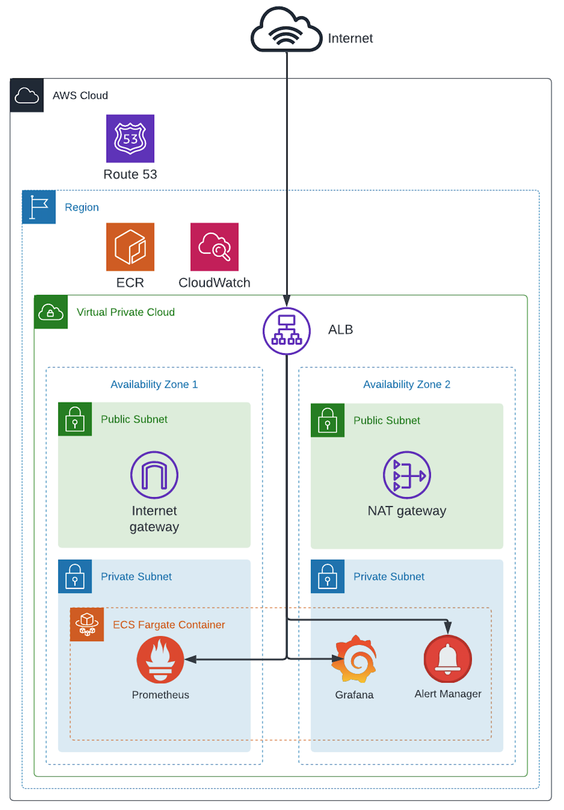
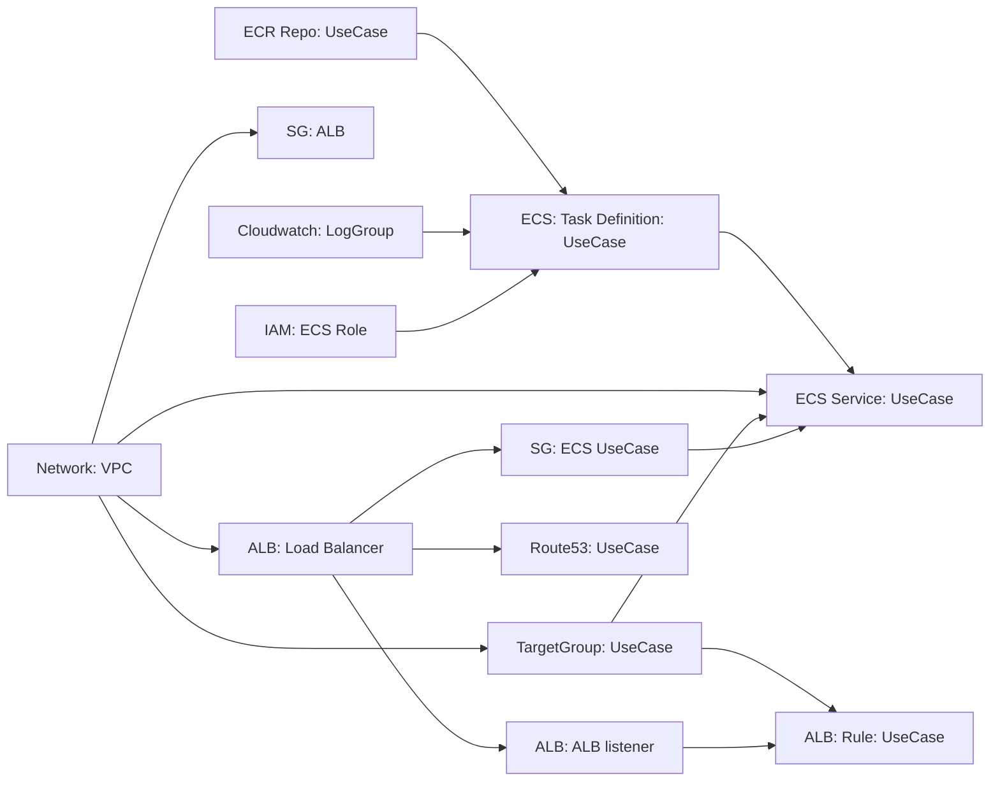

# Introduction

A Confluent Cloud monitoring stack on AWS ECS.

# High-level Architecture



# Terraform Components Dependency Diagram



# Usage

## 0. Update configurations

You need to use `.env.example` to create your own configuration file `.env` under the project root folder.

## 1. Init terraform
```
make tf-init
```
The state file for terraform is under `infra` folder. If you want to change the terraform backend, you need to modify the `Makefile`.


## 2. Create AWS resources
```
make tf-apply
```
## 3. Build and push docker containers
```
make ecr-prometheus
make ecr-grafana
make ecr-alertmanager
```
or
```
make ecr-all
```

## 4. Login into the services

http://prometheus.{{your_domain}}
with username `admin` and password `test`.

http://grafana.{{your_domain}}
with username `admin` and password `test`.

## 5. Destroy all resources
```
make tf-destroy
```

# Future Changes
- EFS mount for Prometheus and Grafana
- Fetch secrets from AWS Secret Manager

# Notes:

Please be aware that Confluent Telemetry has a data latency of about 5 minutes.

[https://api.telemetry.confluent.cloud/docs#section/Client-Considerations-and-Best-Practices/Metric-Data-Latency](https://api.telemetry.confluent.cloud/docs#section/Client-Considerations-and-Best-Practices/Metric-Data-Latency)

# Reference: 

[Confluent JMX Stack](https://github.com/confluentinc/jmx-monitoring-stacks/tree/main/jmxexporter-prometheus-grafana)

[Terraform AWS VPC module](https://github.com/terraform-aws-modules/terraform-aws-vpc)

[Prometheus Configuration](https://prometheus.io/docs/prometheus/latest/configuration/configuration/
)

[Prometheus Basic Authentication](https://prometheus.io/docs/guides/basic-auth/)


[Grafana Configuration](https://grafana.com/docs/grafana/latest/setup-grafana/configure-grafana/)


[Grafana LDAP Integration](https://grafana.com/docs/grafana/latest/setup-grafana/configure-security/configure-authentication/ldap/)


[Alertmanager Configuration](https://prometheus.io/docs/alerting/latest/alertmanager/)

